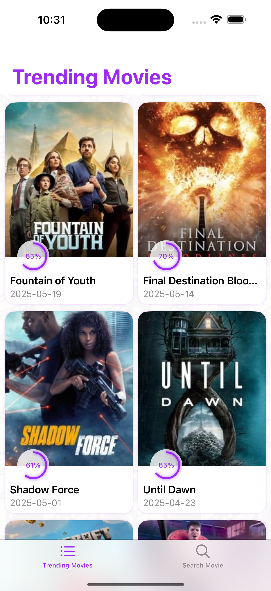
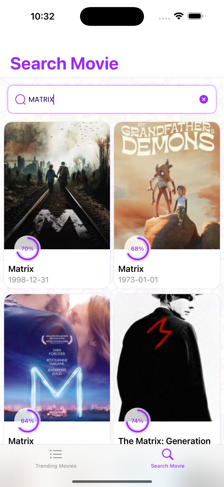
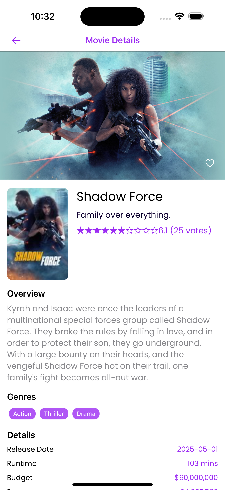
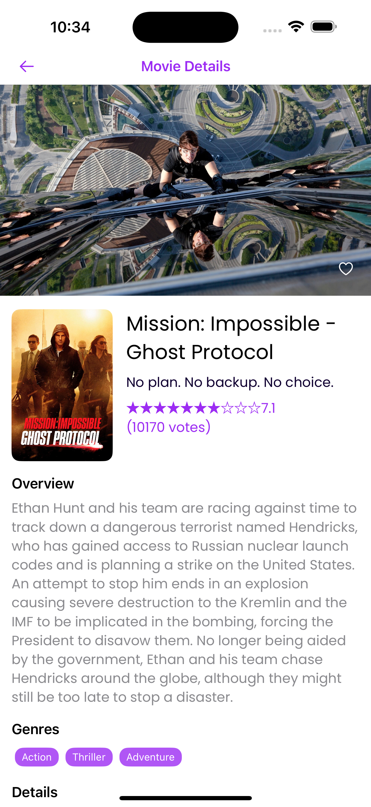

# 📽️ Watchly – TMDB Movie App

**Watchly** is a modern, modular iOS app built using **Swift**, **SwiftUI**, and **async/await**. It interacts with **The Movie Database (TMDB)** to showcase trending movies, detailed views, and favorites. The architecture is clean, testable, and cross-platform ready with a reusable **XCFramework**.

## 📸 Screenshots

| Home Screen              | Search                       | Details                        | Alert                        |
| ------------------------ | ---------------------------- | ------------------------------ | ---------------------------- |
|  |  |  |  |

---


## ✨ Features

- ✅ Trending movie list UI
- ✅ Movie detail screen with rich metadata
- ✅ ⭐ **Favorite button** with local persistence
- ✅ ⚙️ **XCFramework** built for reuse — supports **iOS**, **tvOS**, and **visionOS**
- ✅ ⏱ **Custom debounce** utility for search & UI responsiveness
- ✅ ⏱ **Paging Support** utility for Trending
- ✅ 🧠 **LRU cache** support in memory layer
- ✅ 🌐 **Retry mechanism** on network failure (e.g. no internet)
- ✅ 🧩 UIKit integration example — **SwiftUI + UIKit interop demo**
- ✅ ✅ Uses **async/await only** — no Combine dependency
- ✅ 🧪 50% **unit test coverage**

---

## 🧱 Architecture: Feature-Based Modular Architecture

The Features/ directory is organized using a feature-first approach, where each major functionality (e.g., MovieDetails, SearchMovies, TrendingMoviesList) is isolated and self-contained. Each feature includes:

- ViewModel: Handles state and business logic using ObservableObject.
- §Usecase: Business-specific logic and orchestration of services.
- Service: API or data layer implementations.
- Coordinator: View navigation control.
- View: SwiftUI views, organized by screen.
- Components (optional): Reusable subviews or UI elements.

---

## 📦 Project Structure

```
Watchly/
├── App/
├── Config/
Features/
├── MovieDetails/
│   ├── Components/
│   ├── Coordinator/
│   ├── Service/
│   ├── Usecase/
│   ├── View/
│   └── ViewModel/
│
├── SearchMovies/
│   ├── Components/
│   ├── Coordinator/
│   ├── Service/
│   ├── Usecase/
│   ├── View/
│   └── ViewModel/
│
└── TrendingMoviesList/
|    ├── Coordinator/
|    ├── Service/
|    ├── Usecase/
|    ├── View/
|    └── ViewModel/
├── Frameworks/            # XCFrameworks
├── Resources/
├── Shared/
│   ├── CacheManager/
│   ├── Debounce/
│   ├── FavouriteManager/
│   ├── Loader/
│   ├── NetworkPluggable/
│   └── Router/
├── WatchlyTests/
└── WatchlyUITests/
```

---

## 🧪 Testing

- ✅ Unit Tests: `WatchlyTests/`
- ✅ UI Tests: `WatchlyUITests/`
- Use `⌘ + U` in Xcode or run via CI for automation.

---

## 🧰 Tools & Tech

- Swift 5.9+
- SwiftUI + UIKit (interoperability)
- XCTest / XCUITest
- SwiftLint
- XCFrameworks (iOS / tvOS / visionOS)
- Async/Await concurrency (no Combine)

---

## 🚀 Getting Started

```bash
git clone https://github.com/your-org/Watchly.git
open Watchly.xcodeproj
```

No API key is needed when running with stubs; for live mode, plug in your TMDB key via `.xcconfig`.

---

🙏 Final Note to the Reviewer

Thank you for taking the time to review my submission.

This project reflects my approach to building scalable and testable iOS apps with a focus on clean architecture, modularity, and modern Swift patterns like async/await. I’ve aimed to strike a balance between simplicity and structure, ensuring each feature is independently testable and easy to extend.

I am happy to answer any questions or walk you through specific parts of the code. Looking forward to your feedback!

Warm regards,
Vinsi
